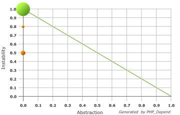
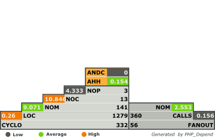

Services and Utilities for Extbase extensions
=============================================

> A collection of Services (for injection) and Utilities (for static calling) for Extbase extensions.

## Code Quality

_Understanding the [Abstraction Instability Chart](http://pdepend.org/documentation/handbook/reports/abstraction-instability-chart.html)
and [Pyramid Chart](http://pdepend.org/documentation/handbook/reports/overview-pyramid.html)._

## What does it do?

Provides class files. Sweet and simple.

## How is it installed?

Download, install the extension and inject/call the provided Services/Utilities.

## How is it used?

Small examples of how to use each Service/Utility can be found in each Service. More detailed examples will be added in the wiki.
